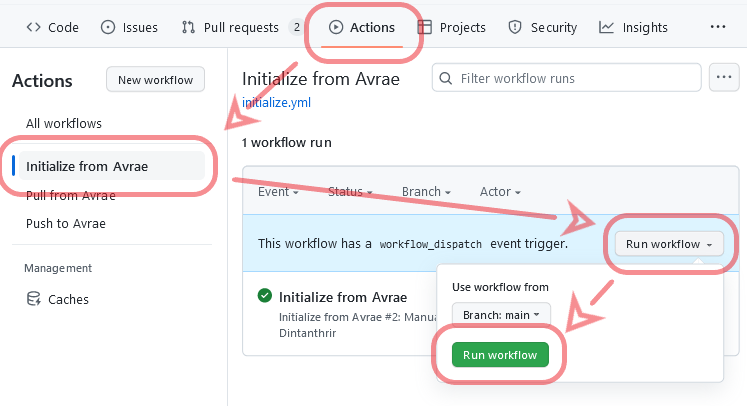

# Github workflows to automate the updating of Avrae collections

1. `initialize` creates configuration files to define which of your collections and gvars should sync with the repository.
2. `pull` copies any missing sources and documentation from Avrea into your repository.
3. `push` creates new alias and snippet code versions for any code changes added to your repository. Documentation and gvars are not versioned in Avrea so those are always overwritten with the contents of your repository when they differ.

## Setup Instructions
### Get your Avrae Token.
You can do this by going to [the Avrae Website](https://avrae.io) and opening up the developer console. Then, go to Storage, Local Storage, and copy the value of the avrae_token.
	* With your Avrae Token, go to your GitHub Repository and click settings. Then, near the bottom-left click Actions -> Secrets. Click New Repository Secret and call it `AVRAE_TOKEN`, and put your token into the value textbox.
### Configure Workflows
Make a new folder in your repository called `.github/workflows`. Copy the .yml files from `examples/workflows` into your workflows directory.
### Initialize Config Files
Run the `initialize` workflow. 
The workflow will generate `collections.json` and `gvars.json` config files and open a pull request to add them to your repository's default branch. These will contain every collection and gvar you have permission to edit on Avrae. 
1. Review and edit these changes before merging them to remove any collections and gvars you do not intend to sync with the current repository.
1. You can update the path where each collection's folder will be created and change its name if you do not want your directories to exactly match the collection name.
1. You can update the path to the file where each gvar will be stored to give them descriptive names or change their extensions to reflect their content types.
1. Merge this pull request. You can rerun the `initialize` workflow at any time to create another PR merging any new collections or gvars you have access to in Avrae into your config files.
### Pull Content from Avrae
Run the `pull` workflow and review the resulting pull request.
- `.alias`, `.snippet`, and `.md` documentation files will be created for each configured collection when those resources are not already present in the repository.
- Files will be created for each configured gvar which does not already exist in the repository.
### Push Changes to Avrae
Commit a change to a configured collection's alias, snippet, docs, or a gvar. Once merged with your `main` branch:
- Changes to documentation and gvars are published to Avrae, overwriting any previous content.
- Changes to aliases and snippets will create new code versions for any changes and set them to be active. New code versions will not be created if the current repository contents match an older or inactive Avrae code version so reverting a change in your repository will not create duplicate versions in Avrae.

## Managing Changes
You can manually re-run the `pull` workflow at any point to create missing files. Existing files will not be overwritten as the tool cannot determine how you would want to resolve conflicts between Avrae and repository versions of the same resource when changes could have been made to both.
Diffs for each file are included in the workflow summary so you can review discrepancies and resolve them manually.

Pushing changes to Avrae can overwrite edits to docs and gvars made directly on the Avrae dashboard. Here too the workflow run will include diffs of each changed file if you need to reconstruct the overwritten changes.

## Customization
By default `initialize` and `pull` are manually triggered while `push` trigges on every push to the `main` branch of your repository. You can change the `on` key to control which events trigger each workflow to make all of them require manual triggers, run on a schedule, or in response to some other [workflow trigger](https://docs.github.com/en/actions/using-workflows/triggering-a-workflow)

The examples provided in `examples/workflows` call [reusable workflows](https://docs.github.com/en/actions/using-workflows/reusing-workflows) in this repository. You can replace the example workflows with a copy of a workflow from `.github/workflows` to customize every step of the workflow and change how pull requests are created or other behaviors.

## Development
This repository is configured to use a [VSCode Dev Container](https://code.visualstudio.com/docs/devcontainers/containers). Follow the Docker setup instructions there and open the project directory in VSCode to develop in a virtual machine containing an appropriate Python version and dependencies.
